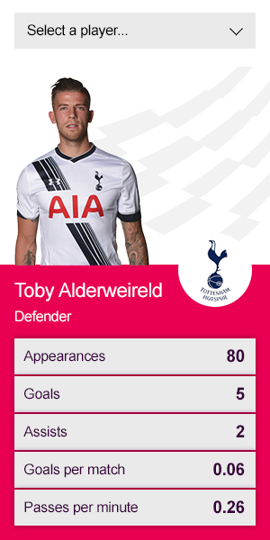

# Frontend Development Task - Player Stats Card

### Task

---
In undertaking this task, please consider the following: 
- Semantic and accessible mark-up 
- CSS produced using SASS 
- Concise Javascript solution 
- Avoid using jQuery or an application framework 
- NodeJS for build/task workflow 
- Future reuse and extension of code 
- Any documentation / notes on build


## Project setup
### Building and running the app
To build the project and run the server run the default task by just typing:
```
gulp
```

## Linting the JavaScript
```
gulp jsLint
```
